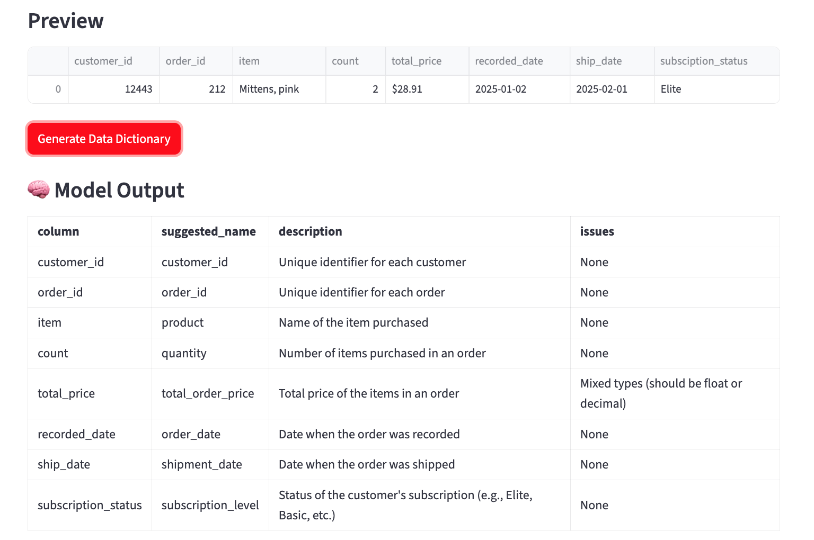

# LLM-Powered Data Dictionary Builder

A Streamlit app that uses an **open-source LLM via [OpenRouter](https://openrouter.ai/)** to automatically generate human-friendly data dictionaries for CSV files.  
Built with **free tools** and fully containerized using **Docker**.



---

## Features
- **Upload a CSV** and preview the data instantly  
- AI-generated:
  - Column descriptions  
  - Suggested better names  
  - Data quality concerns  
- Works with **free-tier LLM access** via OpenRouter  
- Runs **completely in Docker** — no local Python setup needed  
- Output can be copied as Markdown

---

## Tech Stack
- [Python 3.10 Slim](https://hub.docker.com/_/python)
- [Streamlit](https://streamlit.io/)
- [Pandas](https://pandas.pydata.org/)
- [OpenRouter API](https://openrouter.ai/)
- [Docker](https://www.docker.com/)

---

## Installation & Usage

### 1️⃣ Clone the repo
```bash
git clone https://github.com/melissa-nicholas/llm-data-dictionary.git
cd llm-data-dictionary
```

### 2️⃣ Set up your API key
1. Create a free [OpenRouter account](https://openrouter.ai/)
2. Get your API key from **Settings → API Keys**
3. Create a `.env` file in the project root:
```env
OPENROUTER_API_KEY=sk-xxxxxx
```

### 3️⃣ Build the Docker image
```bash
docker build -t llm-data-dict .
```

### 4️⃣ Run the app
```bash
docker run --rm -p 8501:8501 --env-file .env llm-data-dict
```
Then open: [http://localhost:8501](http://localhost:8501)

---

## Project Structure
```
.
├── app.py                # Streamlit app
├── requirements.txt      # Python dependencies
├── Dockerfile            # Docker image definition
├── .env.example          # Example environment file
├── .dockerignore         # Ignore files for Docker build
└── README.md             # This file
```

---

## Example Output
*(Model: mistralai/mistral-7b-instruct via OpenRouter)*

```markdown
| Column Name | Suggested Name | Description | Data Quality Concerns |
|-------------|----------------|-------------|------------------------|
| age         | customer_age   | Age of the customer in years | Missing values for 5% of rows |
| signup_dt   | signup_date    | Date when the user signed up | Some future dates detected |
```

---

## Development (optional local run)
If you prefer not to use Docker:
```bash
python3 -m venv .venv
source .venv/bin/activate
pip install -r requirements.txt
streamlit run app.py
```

---

## License
[MIT License](LICENSE)

---

## Future Ideas
- Export generated dictionary to CSV/Excel
- Support multiple file uploads
- Add embeddings-based column matching
- Deploy to Streamlit Cloud / Hugging Face Spaces

---

**Built with ❤️ by Melissa Nicholas**  
Senior Data & Analytics Engineer | Data Nerd | Dashboard Whisperer  
[Connect on LinkedIn](https://www.linkedin.com/in/melissa-nicholas-7a143593/)
